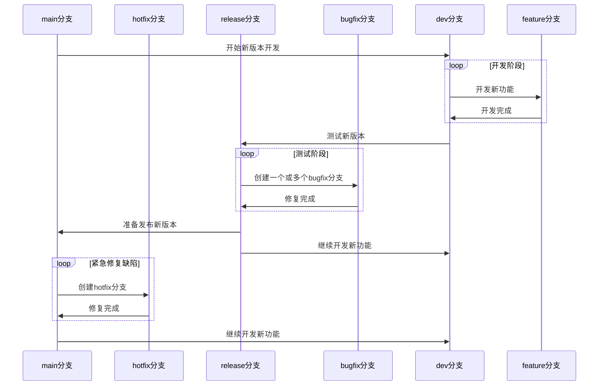

# Git 分支管理

## 分支分类

在开发时会用到的分支种类一共分为两大类和四小类，每种分支对应着不同的情况，只有在必要的时候添加分支。

### 主分支

主分支分为两个小类：

1. 用于存放可用版本代码的 Main 分支

2. 用于存放开发中已经可用但是没有完成版本目标的代码的 Dev 分支

主分支全部都是长期存在的分支，如果没有必要尽量不进行回滚。主分支是所有开发活动的核心分支。所有的开发活动产生的代码最终都会反映到主分支中。

#### Main 分支

Main 分支上存放的应该是随时可供在生产环境中部署的代码。当开发活动告一段落，产生了一份新的可供部署的代码时， Main 分支上的代码会被更新。同时，每一次更新，最好添加对应的版本号标签。

#### Dev 分支

Dev 分支是保存当前最新开发成果的分支。日常的开发工作完成后可以合并到该分支。

### 辅助分支

辅助分支包括四个小类：

1. 用于开发新功能时所使用的 Feature 分支（从 Dev 分支派生）

2. 用于测试和辅助版本发布的 Release 分支（从 Dev 分支派生）

3. 用于发布前修改的缺陷的 Bugfix 分支（从 Release 分支派生）

4. 用于紧急修正生产代码中的缺陷的 Hotfix 分支（从 Main 分支派生）

辅助分支全部都是临时性分支，每次完成对应的工作合并回原分支以后就应该添加新分支，并在新分支上工作。

#### Feature 分支

需要开发新功能的时候需要从 Dev 主分支中创建 Feature 分支。开发完成后需要对代码进行 Review ，没有问题后可自行合并回 Dev 分支。

#### Release 分支

release分支是为发布新的产品版本而设计的。在这个分支上准备发布版本所需的各项说明信息（版本号、发布时间、编译时间等等）。通过在release分支上进行这些工作可以让Dev分支空闲出来以接受新的feature分支上的代码提交，进入新的开发迭代周期。

#### Bugfix 分支

用来修复 Release 分支中遇到的问题，与 Feature 分支很相似。需要从 Release 分支上派生，修复对应 BUG 后合并回 Release 分支。

#### Hotfix 分支

Hotfix 分支与 Release 分支十分相似：都可以产生一个新的可供在生产环境部署的版本。当生产环境中遇到了异常情况或者发现了严重到必须立即修复的缺陷的时候，就需要从 Main 分支上派生 Hotfix 分支来组织代码的紧急修复工作。

## 分支命名

分支命名可以有效地区分每个分支的作用。这里主要是用于规定临时分支的命名。

### 命名方法

临时分支使用类型和功能描述命名：

```text
<branch type>-<description>
```

其中：

- `<branch type>` 填写分支类型，全小写必须是四种辅助分支中的一种。
- `<description>` 填写分支功能，全小写用 `-` 分割单词。

例如：

```text
feature-add-some-new-function
```

## 分支流程图


