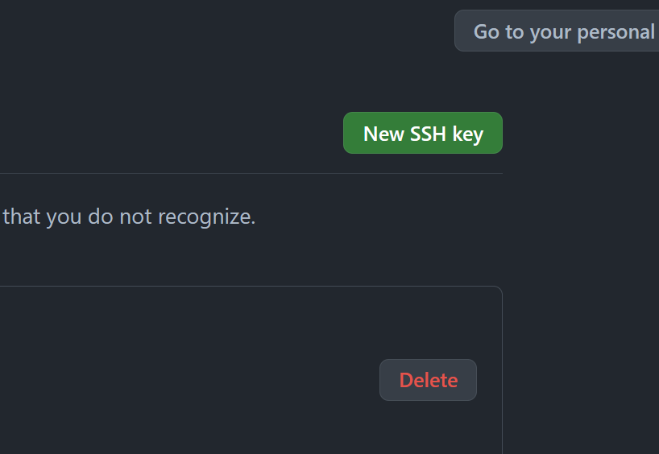

# Github 密钥配置说明

## 生成密钥对

```bash
# 打开 git bash 使用指令生成密钥
# 输入两次提交用的密码（使用两次回车可以免密操作）
ssh-keygen -t rsa -C <your email> -f $HOME/.ssh/spider_rsa
```

## 添加密钥设置

1. 打开 git bash 使用指令打开配置文件

    ```bash
    # 如果文件不存在则创建文件
    touch $HOME/.ssh/config

    # 使用 VS Code 打开配置文件
    code $HOME/.ssh/config
    ```

2. 在文件结尾添加一条新的设置，在访问 HostName 的地址时使用指定的密钥

    ```text
    Host <Host Name>
        HostName 192.168.52.85
        PreferredAuthentications publickey
        IdentityFile ~/.ssh/spider_rsa
    ```

## 在 Github 添加密钥

1. 使用指令将公钥复制到剪切板

    ```bash
    clip < $HOME/.ssh/spider_rsa.pub
    ```

2. 打开并登录 Github

3. 点击右上角的头像选择 `Settings`

    

4. 在左侧的菜单栏中选择 `SSH and GPG keys`

    

5. 点击 `New SSH key` 新建一个 SSH 密钥

    

6. 将剪切板中的密钥粘贴到输入框中

7. 填写标题用于区分设备

8. 选择添加密钥

## 测试密钥

```bash
# 使用指令测试密钥
ssh -T ssh://git@<Host Name>:2223

# 返回 Welcome to Github, @<username>! 则设置成功
```
