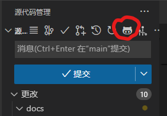

# Github 工作流程

> 介绍使用 Github 的协作流程，需要先克隆过仓库，具体操作详见 [克隆仓库] 。

## 创建分支

> 分支命名方式详见 [分支管理说明] 。

```bash
# 创建并切换到新分支
git checkout -b <branch>
```

## 新建提交

> 创建提交时需要尽可能细粒度，尽量避免一次性提交好几百行的情况。
> 提交描述请遵守 [Angular 提交规范] ，推荐使用插件生成。

每次创建提交前请确认重要的修改是否都添加到了 [CHANGELOG] 中。
对于 [CHANGELOG] 的修改需要和功能的修改一起提交。

> 生成变更记录可以使用 [Keep a Changelog] 插件补全。

### 使用指令创建提交

```bash
# 暂存文件或文件夹
git add <filename1> <filename2> ...
git add <dir>

# 创建提交
git commit -m <message>
```

### 使用 VS Code 可视化创建提交

1. 使用快捷键 `Ctrl + Shift + G` `G` 切换到 SCM 窗口

2. 选择要提交的文件，并在打开的 Diff 窗口中选中右侧的要提交的内容

3. 右键选择暂存所选范围

4. 使用 `git-commit-plugin` 插件生成提交信息

    

5. 点击提交按钮

## 合并主分支

> 完成某功能开发后需要先合并上游分支，并处理冲突后才能提交 PR 。

```bash
# 切换到上游分支
git checkout <work branch>

# 拉取远程代码
git pull [remote] [upstream branch]

# 切换回工作分支
git checkout <branch>

# 合并工作分支和上游分支
# 此时可能会发生冲突，可以在 VS Code 中寻找带叹号的文件，选择要保留的部分
# 解决冲突后需要进行一次提交，保存合并后的内容
git merge <upstream branch>

# 推送到远程仓库
git push -u <remote> <branch>
```

## 在 Github 创建 PR

> 推送分支到远程后需要创建合并请求（Pull Request），审核通过后才能合并到上游分支。

1. 打开 Github 页面，在左侧的菜单栏中选择 `合并请求` ，并选择新建合并请求。

    > 打开推送后提示的链接可以自动以刚才的 commit 创建新的 PR 。

2. 在源分支中选择刚上传的工作分支，在目标分支中选择要合并到的上游分支。

3. 指定审核者并确认创建 PR 。

    > 可以完成一个实际功能时提交合并请求，也可以选择 draft PR 标记此 PR 为未完成，等完成后即可合并。
    > 不要立即删除原有的分支，如果有问题还会需要重新修改。建议等被确认合并以后再删除

<!-- Links -->

[克隆仓库]: ../README.md#🏠-克隆仓库
[分支管理说明]: ./git-branch.md

[CHANGELOG]: ../CHANGELOG.md

[Keep a Changelog]: https://marketplace.visualstudio.com/items?itemName=RLNT.keep-a-changelog
[Angular 提交规范]: https://zj-git-guide.readthedocs.io/zh_CN/latest/message/Angular%E6%8F%90%E4%BA%A4%E4%BF%A1%E6%81%AF%E8%A7%84%E8%8C%83/
